# AnyAutomation Studio

**The automation engineering IDE for TIA Portal** — AI code generation, PLC online access, SCL unit testing, PLCSIM Advanced, OPC UA, Forge, and CI/CD, in one code-first workspace.

> The next generation of **TIA Openness Manager** — the same familiar capabilities, rebuilt in a new code-first editor, with much more on top.

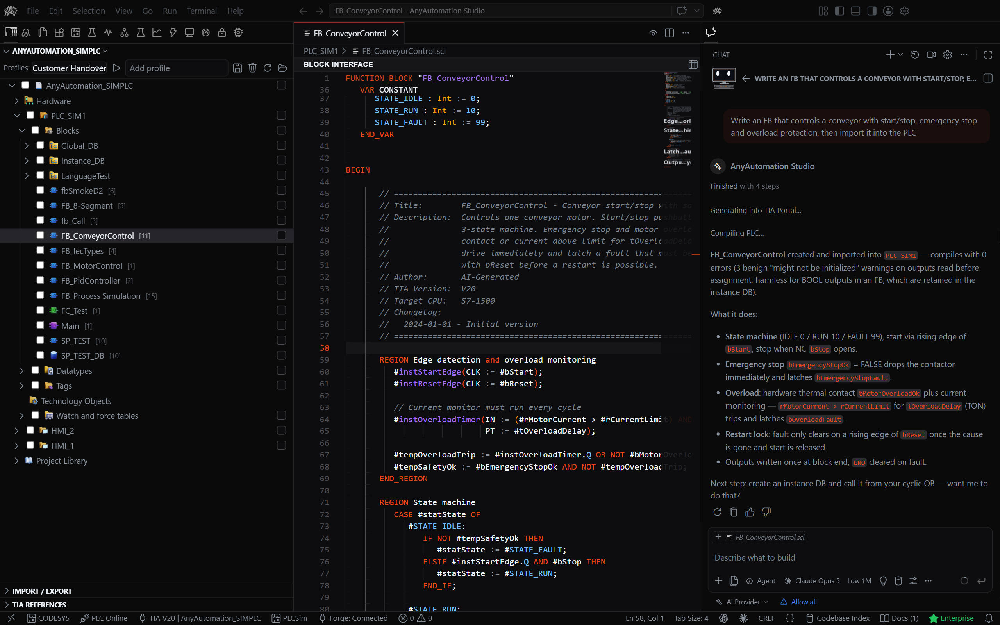

This repository is also the **public release channel**.

---

## Download & Install

1. Open the [Releases](https://github.com/StaniB88/AnyAutomationStudio/releases/latest) page.
2. Download `AnyAutomationStudioSetup-x64-*.exe` (system-wide install, one admin prompt; TIA Portal Openness access is registered automatically).
3. Run the installer and launch AnyAutomation Studio.

Studio checks for updates on startup and installs them in the background. New users get a free trial with all features unlocked.

---

## Built Around AI

Studio puts an AI assistant at the centre of automation engineering — across your whole project.

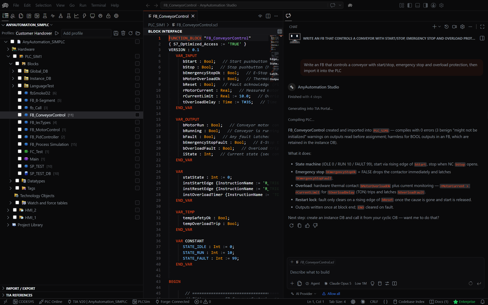

- **AI Cascade** — a project-wide assistant that reads your whole project to ask, generate, and refactor with full context (MCP, multi-provider).
- **Agents window** — hand a task to the assistant and let it run: start sessions against local or remote projects, run several in parallel, then review and apply each session's changes.
- **Code generation** — the AI writes SCL blocks, DBs, UDTs, and tag tables, and imports them straight into TIA Portal.

---

## Everything in One Workspace

| Capability | What it does |
|---|---|
| **AI Cascade** | Project-wide AI assistant — ask, generate, refactor with full context. |
| **Agents Window** | Run multiple AI agent sessions in parallel, local or remote; review and apply changes. |
| **TIA Portal** | Analyse, export, compare, and generate blocks programmatically (V15–V21, Openness). |
| **Multi-User** | Open, edit, and commit TIA Multi-User sessions; upload and check out from a TIA Project Server. |
| **PLC Online** | Live to the controller — watch and write values without TIA Portal open (S7, OPC UA). |
| **Hardware Simulation** | Spin up and control PLCSIM Advanced instances — no physical hardware. |
| **Unit Testing** | SCL unit tests on PLCSIM or real hardware, AI-authored, with CI/CD. |
| **Forge** | Reusable block-type library — capture, organise, deploy into a PLC. |
| **OPC UA** | Browse the address space, read/write, live subscriptions. |
| **Trace** | Oscilloscope-style live signal trace and dashboards. |
| **SCADA** | Generate a [FUXA](https://github.com/frangoteam/FUXA) web SCADA from your PLC's signals and provision it to a running instance ([demo video](https://www.youtube.com/watch?v=UH5bOJk1R7U)). |
| **Import / Export** | Bulk export/import with folder structure, compile, and diff. |
| **Find Unused** | Detect and clean up unreferenced blocks across the project. |
| **Password Vault** | AES-256 encrypted vault for know-how-protection passwords. |
| **Git Client** | Full version control for your automation project. |
| **EPLAN Connector** | Bridge to EPLAN for electrical-engineering data exchange. |

Available in 14 display languages.

---

## Highlights

### TIA Portal — Import & Export

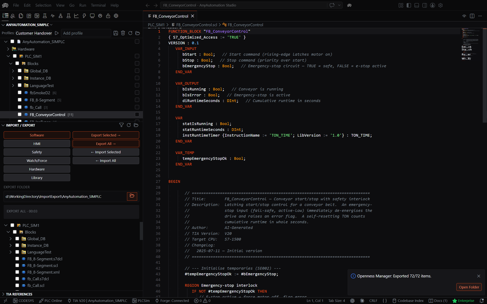

Bulk export and import hundreds of blocks at once in XML, SCL, or S7DCL, with the folder structure preserved and automatic compile on import. Software, HMI, Safety, Watch/Force, and Hardware are all covered.

### Multi-User Engineering

Open, edit, and **commit** a TIA Multi-User session entirely inside Studio, without keeping TIA Portal open. Upload a single-user project to a TIA Project Server and check it out, so a whole team works on one project at the same time.

### PLC Online & OPC UA

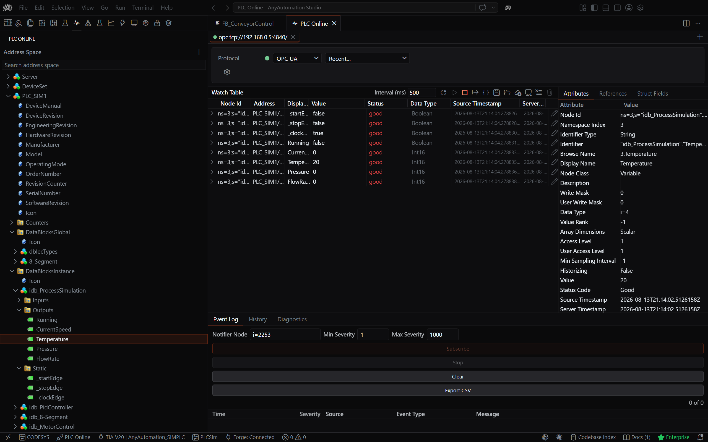

Go live to the controller without TIA Portal open: browse the address space, read and write values, and live-subscribe through native S7 or OPC UA. Save and load watch configurations and export data as CSV or JSON.

### Hardware Simulation

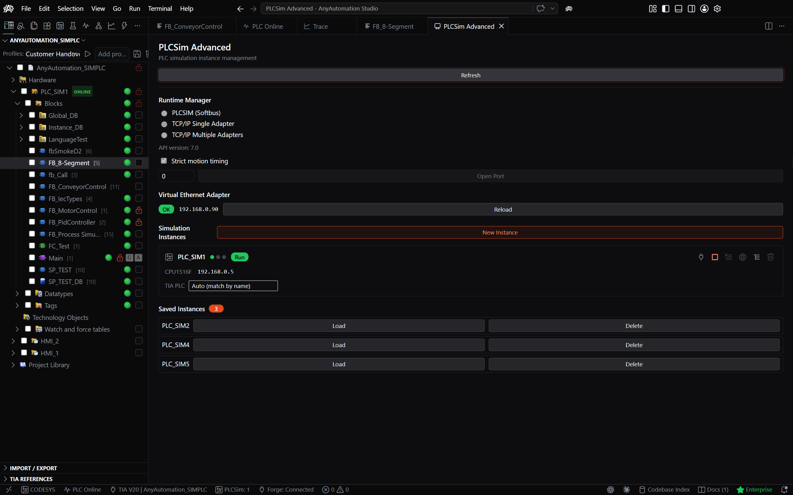

Spin up and control PLCSIM Advanced instances right from Studio — develop and test without physical hardware.

### Unit Testing

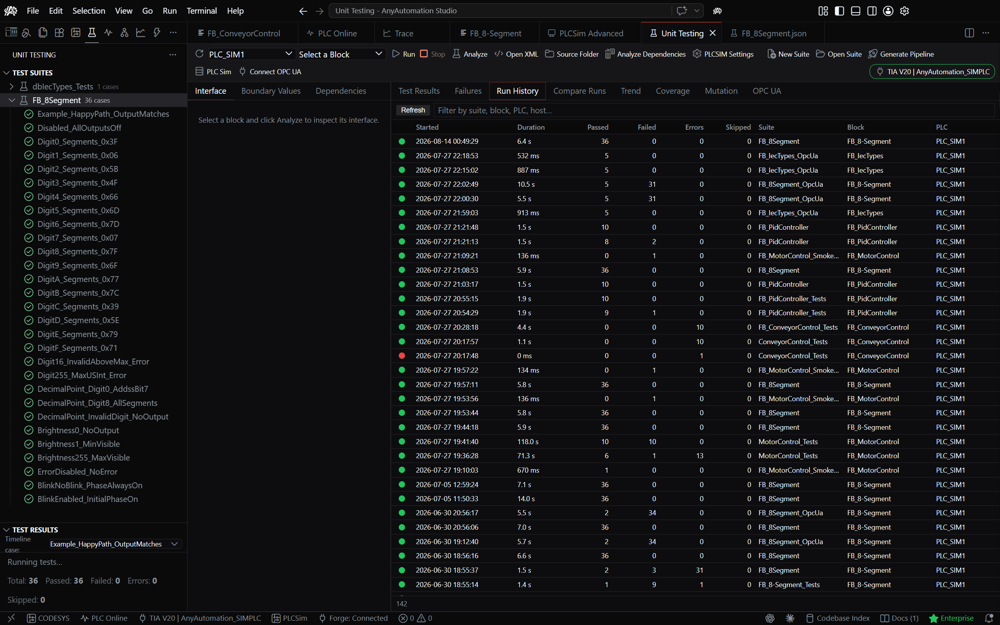

Write, run, and evaluate SCL unit tests against PLCSIM Advanced **or a real S7 PLC**. AI-authored test cases, boundary generation, Visual / JSON / SCL editing, persisted pass/fail history, and **CI/CD** integration.

> Requires **PLCSIM Advanced V3.0+** (separate Siemens license) for simulation-based runs.

### Forge — Block Type Library

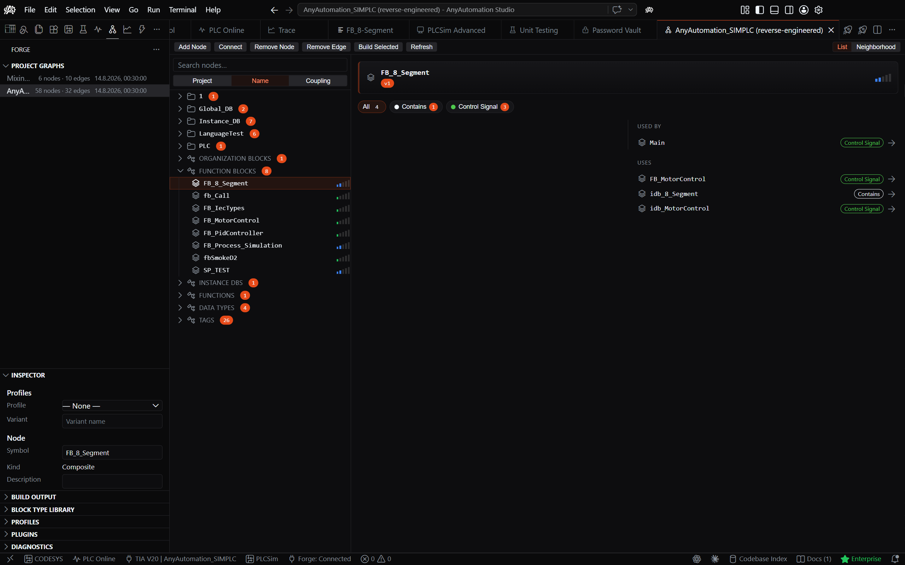

Capture existing blocks into a reusable **Block Type Library**, organise them into folders, and deploy the whole library into any connected PLC — the folder structure is recreated as the group structure inside the PLC.

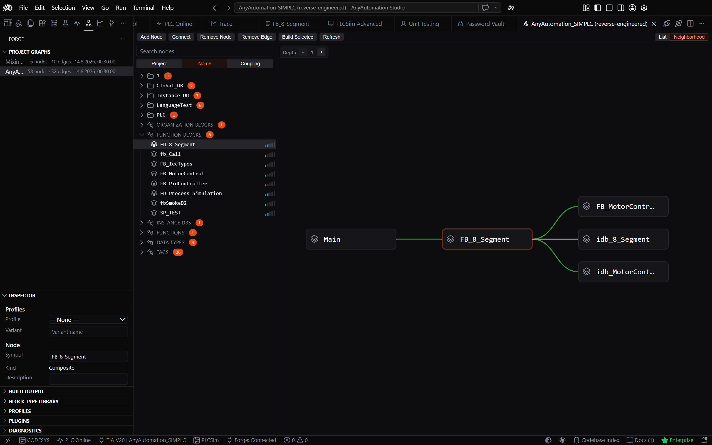

### SCADA — Generate a FUXA Dashboard

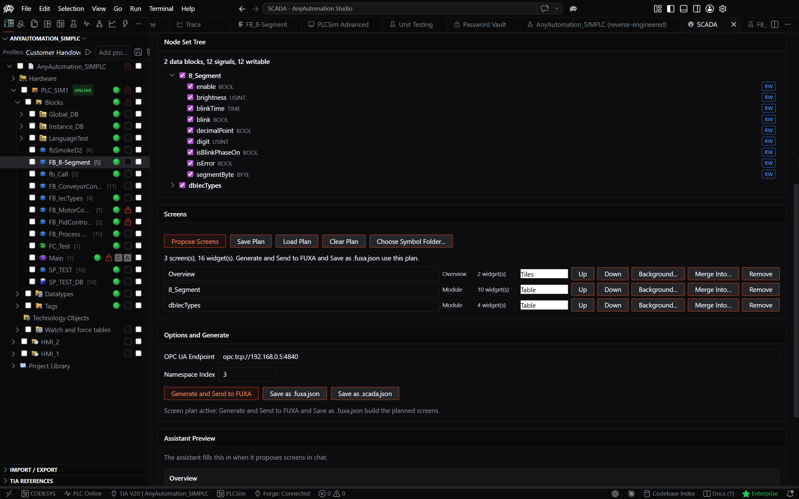

[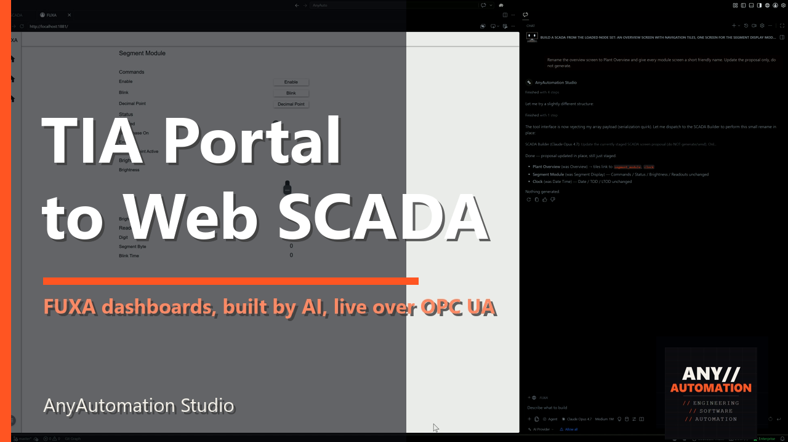](https://www.youtube.com/watch?v=UH5bOJk1R7U)

Turn a CPU's OPC UA nodes into a complete **FUXA** web SCADA: one OPC UA device, a tag per signal, and screens grouped by function. Provision it straight onto a self-hosted FUXA instance over the admin REST API, or save it as a project file. Every tag binds to its real OPC UA node id, so live values work immediately. FUXA is open source (MIT) by frangoteam. [Watch the demo.](https://www.youtube.com/watch?v=UH5bOJk1R7U)

### Trace

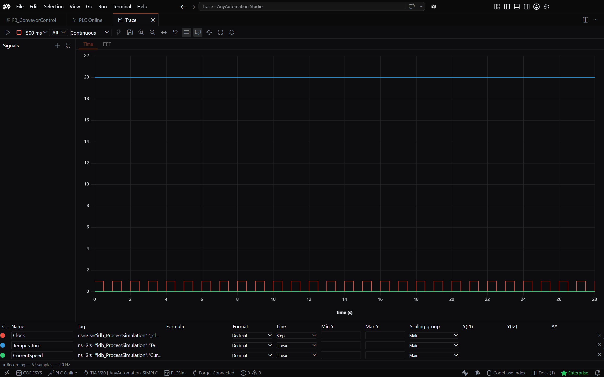

Oscilloscope-style live signal trace and dashboards for watching your process in real time.

### Difference Comparison

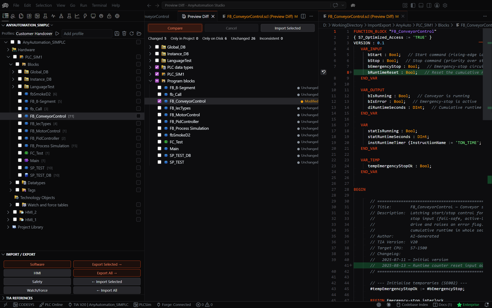

Fast, fingerprint-based diff that detects modified, new, and deleted blocks, with a line-by-line viewer and selective re-export.

### Code Editor

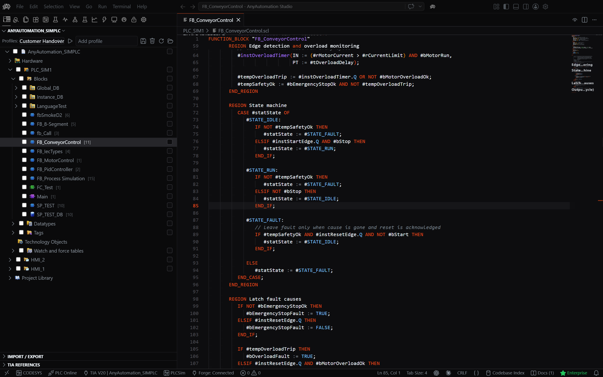

A full editor workbench with SCL syntax highlighting, search & replace, and inline diff. Edit graphical LAD/FBD/GRAPH blocks as editable S7DCL source on TIA Portal V20+.

### Protection & Password Vault

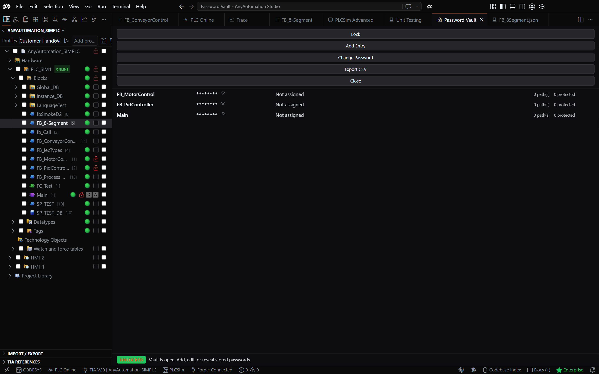

Protect critical blocks against accidental overwrites, and store know-how-protection passwords in an AES-256-GCM encrypted vault behind a single master password, with bulk protect / unprotect.

---

## Plans

| Plan | Highlights |
|---|---|
| **Basic** | Core toolset, TIA Portal connection, AI Chat. |
| **Pro** | Unlimited capacity and the full Pro toolset. |
| **Pro+** | Pro plus Forge and the EPLAN connector. |
| **Enterprise** | Role-based access control, SSO, team/organisation management, dedicated support. |

Monthly or yearly, in CHF, cancel any time. See the full comparison at [anyautomation.ch/studio](https://anyautomation.ch/studio#studio-pricing).

---

## Supported TIA Portal Versions

V15 · V16 · V17 · V18 · V19 · V20 · V21

---

## Languages

English · Deutsch · Français · Italiano · Español · Português (BR) · Türkçe · Polski · Čeština · Русский · 日本語 · 한국어 · 简体中文 · 繁體中文

---

## Release Channel Notes

- `latest.json` is the machine-readable update manifest consumed by the in-app updater.
- `CHANGELOG.md` lists user-facing changes.
- Files written by the release pipeline (`latest.json`, release assets) are generated — do not edit by hand.
- Old releases are kept; their asset URLs stay valid.

---

## Support

- **Website:** [anyautomation.ch](https://anyautomation.ch/)
- **Docs:** [anyautomation.ch/docs](https://anyautomation.ch/docs)
- **YouTube:** [youtube.com/@AnyAutomation-Studio](https://www.youtube.com/@AnyAutomation-Studio)
- **Issues:** [GitHub Issues](https://github.com/StaniB88/AnyAutomationStudio/issues)

---

## Disclaimer

**The software is provided "as is" without warranty of any kind.**

The provider assumes no liability for:

- Damages caused by faulty LLM outputs or AI-generated code
- Data loss, production downtime, or system failures
- Engineering errors or faulty code generation
- Damages caused by improper use or configuration

**The user bears full responsibility for reviewing and validating all generated content before use in production systems.**

This software uses the official Siemens TIA Portal Openness API. Siemens and TIA Portal are registered trademarks of Siemens AG.

---

**© 2026 AnyAutomation. All rights reserved.**

**Made with passion for the automation community**
